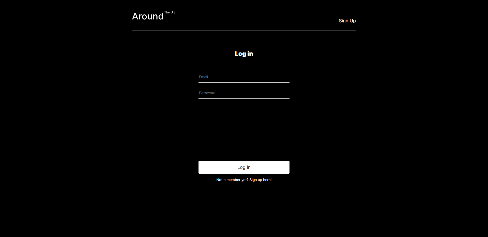
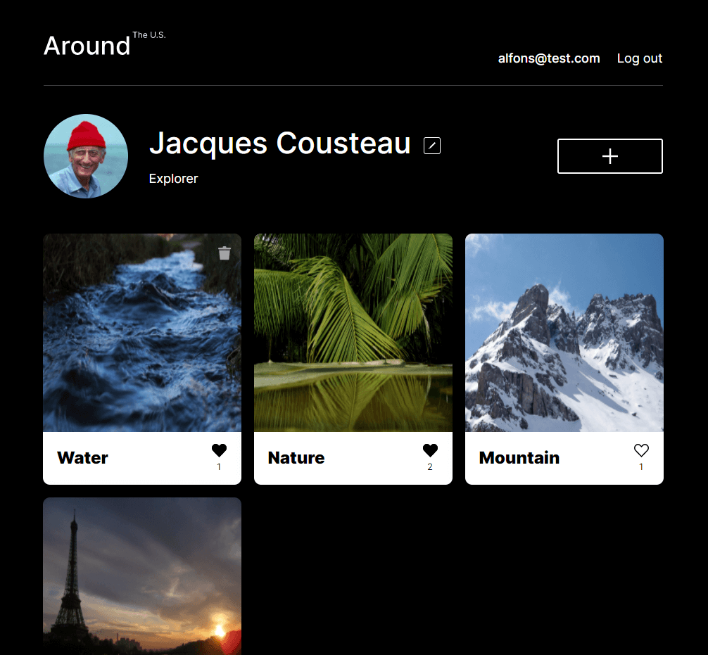
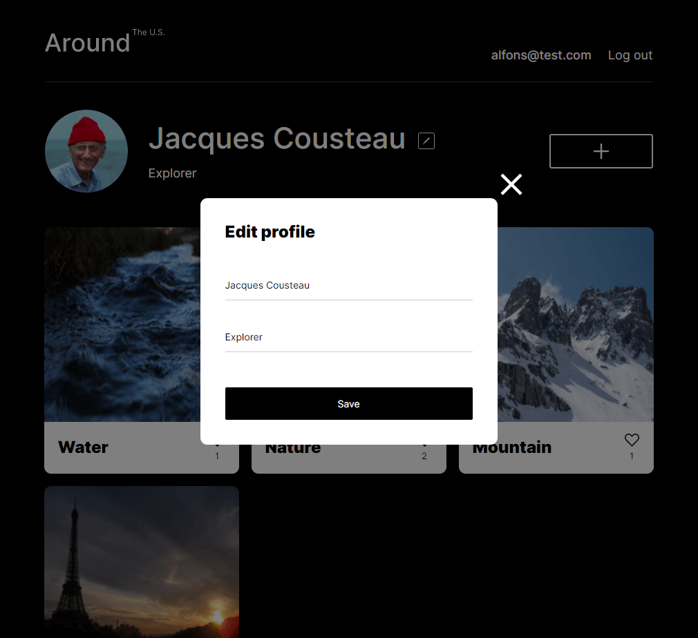
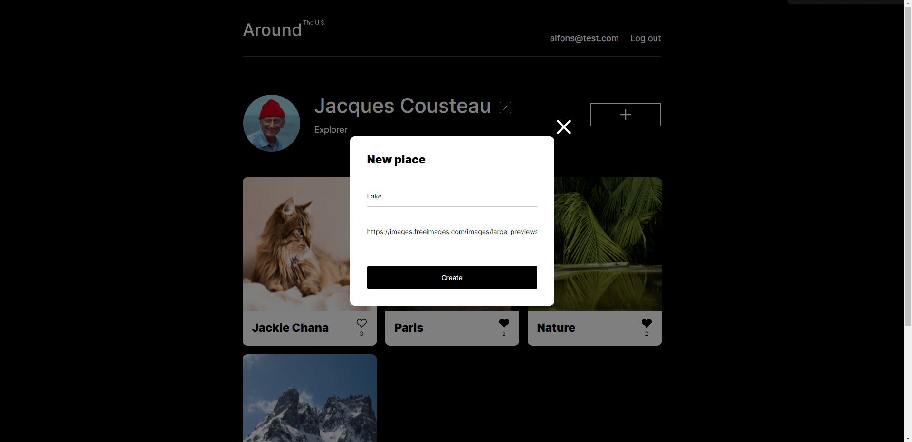
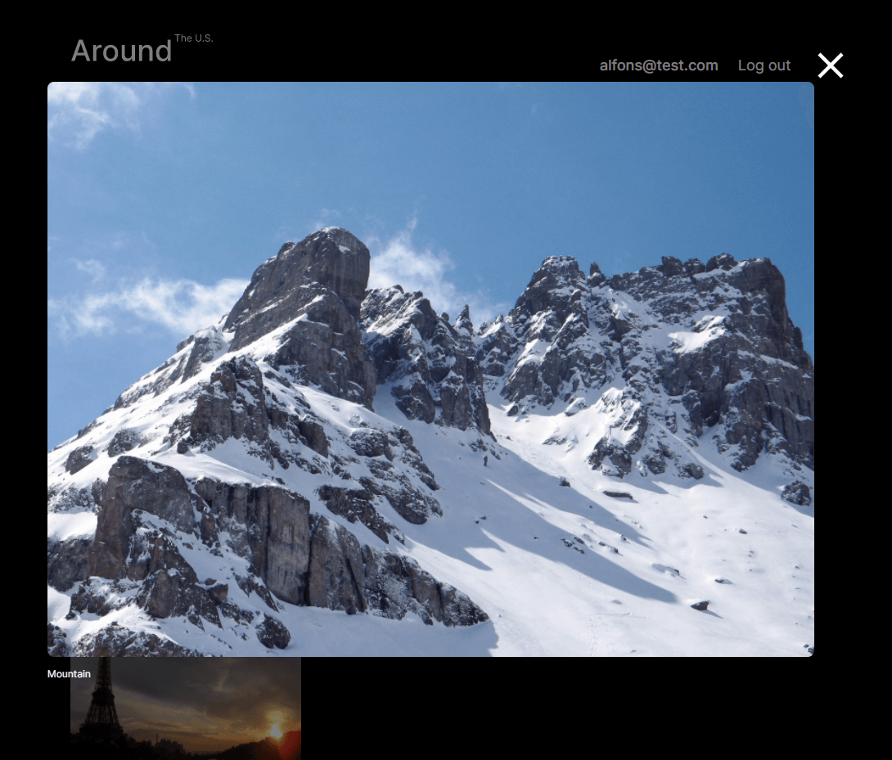

# Around the U.S. 

## This repository contains:

- The **[backend API](https://api.naim-usa.students.nomoredomainssbs.ru)** of "Around the U.S." with authorization and registration handled by the back-end server.
- The **[frontend](https://naim-usa.students.nomoredomainssbs.ru)** React Application which uses this API
  
## Project overview

- Registration and login users
- Customize your user data (name, about, avatar)
- Post and remove photos
- Like photos
  
## In this project I've specialized in:

- Node.js
- Express.js
- MongoDB
- React
- Adaptive design
- Fetch requests
- Google cloud

## Links
    
- **[Live Website](https://naim-usa.students.nomoredomainssbs.ru)**
- **[Backend API](https://api.naim-usa.students.nomoredomainssbs.ru)**

## Screenshots

#### Log-in

#### Main

#### Update User info

#### Update user avatar

#### Add Place

#### Image Preview

