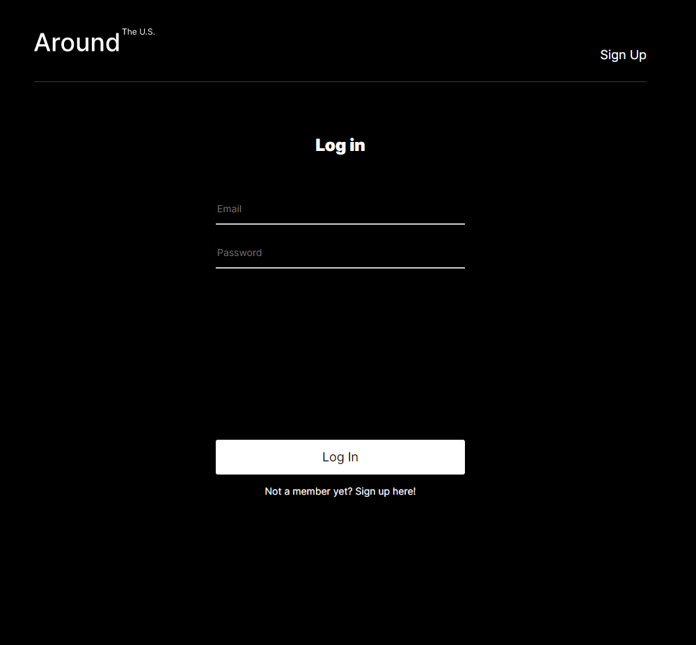
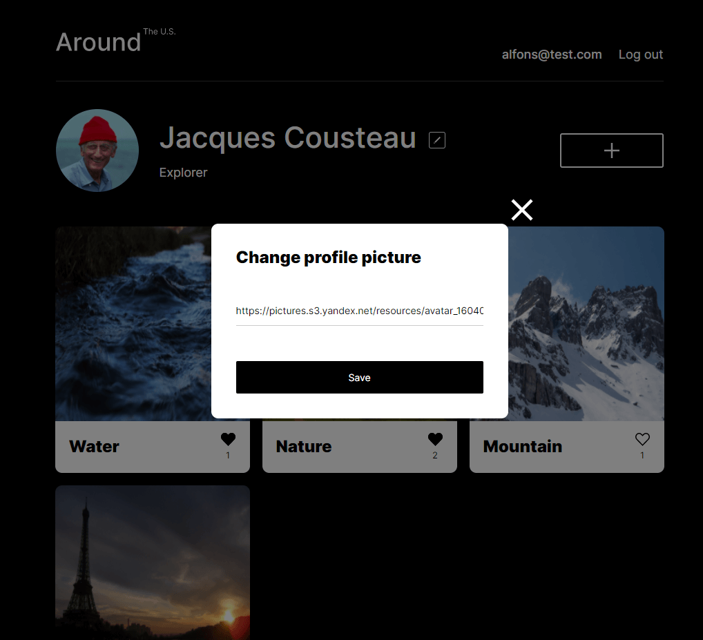
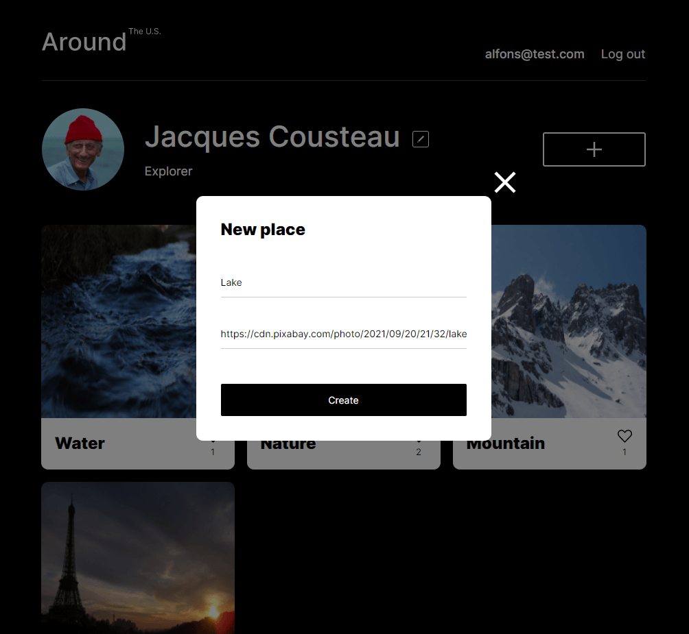

# Around the U.S. 
  
## Project overview

- Registration and login users
- Customize your user data (name, about, avatar)
- Post and remove photos
- Like photos
  
## In this project I've specialized in:

- Node.js
- Express.js
- MongoDB
- React
- Adaptive design
- Fetch requests
- Google cloud

## Screenshots

#### Log-in

#### Main

#### Update User info

#### Update user avatar

#### Add Place

#### Image Preview

